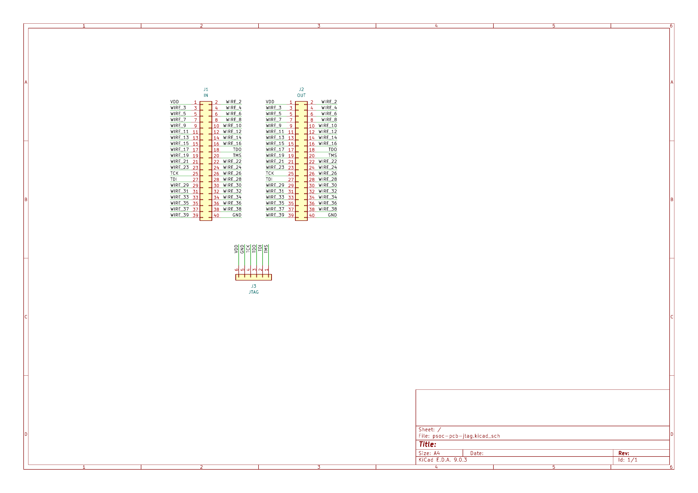

# PSoC JTAG Adapter PCB

This repository contains schematic and layout for the PSoC JTAG adapter PCB.
It is meant to be used with the [main PSoC FMC PCB](https://github.com/kit-kch/psoc-pcb-fmc) and a [Digilent JTAG HS2](https://digilent.com/shop/jtag-hs2-programming-cable/?srsltid=AfmBOorvOwsRU_3dW2jPg2jQcidQeIOP8MnjYPq41F86tJ_p7KsCbM9X) to provide easy access to the programming interface.

The following parts have been used to manufacture the PCB, but compatible ones should work as well:

| Reference | Vendor   | Part               |
|-----------|----------|--------------------|
| J1        | samtec   | SSM-120-F-DV       |
| J2        | 3M       | D2540-6V0C-AR-WG   |
| J3        | Adam Tech| PH1RB-06-UA        |

For more information, refer to the psoc project website at [kch.dev/psoc](https://kch.dev/psoc).
